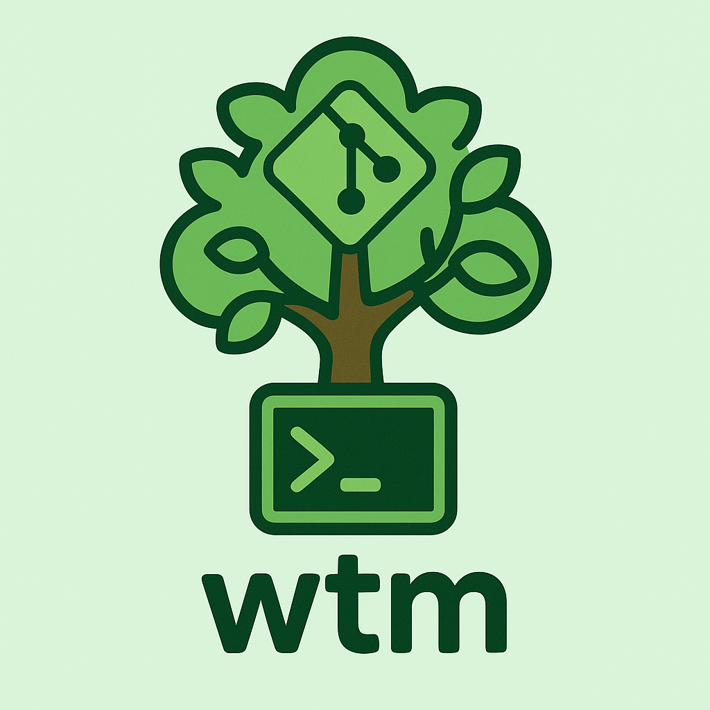

# Worktree Manager

<p align="left">
Makes using worktrees easier
</p>
<p align="left">
At the core, it just creates a new worktree with a branch name and installs deps.
</p>
<p align="right">

</p>

## Usage

`wtm <option> <branch-or-path>`

Branch names do not need `origin` prefixed. Local branches are automatically created if not present.

Available options are
- `create`: creates a new worktree from a branch (specifying `origin` is not necessary)
- `remove`: removes an existing worktree (autocompletes from `worktree-dir`)
- `list`  : lists your available worktrees
- `switch`: brings up a fzf prompt to select a worktree and changes cwd to that worktree. 
- `--help`: prints a help menu


> [!IMPORTANT]  
> You must install the appropriate shell function `wtm` for the `switch` command to work properly.

## Shell Function

In order to use the `switch` command you'll need to add the wtm function to your shell like this:
#### ~/.bashrc or ~/.bash_profile
source $(brew --prefix)/share/wtm/wtm.bash

#### ~/.zshrc
source $(brew --prefix)/share/wtm/wtm.zsh

#### Fish
ln -s (brew --prefix)/share/wtm/wtm.fish ~/.config/fish/functions/wtm.fish

or

source (brew --prefix)/share/wtm/wtm.fish

## Configuration

Configuration is handled by a file either at
`~/.config/worktree-manager/config.json` or `~/.worktree-manager`

Options are listed here.

- `worktree-dir` is where your worktrees will be created
- `main-worktree-dir` is the root of your project, called the "main worktree"

Note that both of these should be **absolute paths**.

``` json
{
  "worktree-dir": "/Users/brandon/work/worktrees",
  "main-worktree-dir": "<absolute path to your project file>",
  "jobs": []
}
```

### Jobs
Jobs are run after you create a worktree, and are defined in your config file. 

There are 3 kinds of valid jobs

Strings are a valid job.  This is a command that will be run in the root directory.

There are two kinds of object jobs. Both have a key `command`, which is the
command to run, but you can additionally specify `dir` to run that command in a
directory relative to the root, or you can specify `dirs` to run the same
command in different directories (also all relative to the root).

The following are all valid jobs

``` 
"npm install"
```

``` json
{
  "command": "npm install",
  "dir": "client" 
}
```

``` json
{
  "command": "npm install",
  "dirs": ["client", "server", "."]
}
```

## Installation


### Homebrew

``` shell
brew tap bolivier/worktree-manager
brew install worktree-manager
```

### From Source

Install [`babashka`](https://github.com/babashka/babashka)

Put `<workspace-root>/bin/wtm` on your path. There's a task you can run with `bb
install` that will stick it in `~/bin`.

#### Optional:

Install autocomplete so you don't have to type branch names or worktree paths to remove.

##### Fish
Symlink the autocomplete file `<workspace-root>/resources/autocomplete/wtm.fish` to `~/.config/fish/completions/wtm.fish`.

##### Zsh
Add a line in your `.zshrc` to source the file `<workspace-root>/resources/autocomplete/wtm-completion.zsh`

##### Bash
Add a line in your `.bashrc` to source the file `<workspace-root>/resources/autocomplete/wtm-completion.bash`
